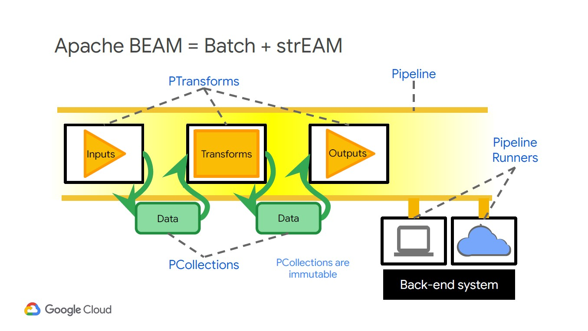

## Resources
* Great Airflow DAG tutorial: https://airflow.apache.org/tutorial.html

# 1. Building batch data pipelines

* BQ - only simple transformations with SQL
* More complex transformations > ETL Pipelines in Dataflow

## 1.1. When to use EL, ELT or ETL?
### 1.1.1. EL
* only if the data are already clean and correct
*batch loading historical data, or do scheduled loads of log files e.g. extract from Cloud Storage and load into BQ native storage

### 1.1.2. ELT
* Experimental datasets where you are not yet sure what kinds of transformations are needed to make the data useable.
* transformation can be expressed in SQL
* Extract data from files in Google Cloud Storage into BigQuery
* Transform the data on the fly using BigQuery views, or store into new tables

### 1.1.3. ETL
* For more complex transformations (e.g. translate text)
    * Extract data from Pub/Sub, Google Cloud Storage, Cloud Spanner, Cloud SQL > ETL Pipelines in Dataflow > Write to BQ
* Data Transformation and streaming pipeline services: **Cloud Dataflow, Cloud Dataproc, Cloud Data Fusion**
* When the raw data needs to be quality-controlled, transformed, or enriched before being loaded into BigQuery.
* transforms are difficult to do in SQL.
* When the data loading has to happen continuously, i.e. if the use case requires streaming. Dataflow supports streaming.
* When you want to integrate with continuous integration CI/CD systems and perform unit testing on all components.

#### 1.1.3.1. Solutions per use case:
Recommend start with Dataflow for ETL > BQ. Dataproc and Dataflow can be used for more complex ETL pipelines.
* Performance / low latency: Dataflow > Load to Bigtable (NoSQL DB)
* Reusing Spark pipelines: Dataproc
* Visual pipeline building: Data Fusion

## 1.2. Cloud Dataproc 
* based on Apache Hadoop; managed Spark and Hadoop service
* Dataproc simplifies Hadoop workloads on GCP (vs on-prem Hadoop)
    * automation helps you create clusters quickly, shut down when not used
    * Managed hardware and configuration
    * Simplified version management (open source components and ability to switch between different images running different versions of Spark, Hadoop etc)
    * Flexible job configuration e.g. cluster configuration

### 1.2.1. Setting up a Dataproc cluster
* Best practice: "ephemeral clusters" - spin up Dataproc clusters for specific jobs, do not have long-running clusters - clusters are quick to spin up (90 secs)
* For a cost effective set up, minimise number of worker nodes and use Preemptable nodes (no SLAs, 80% discount, spot instance)
* Disk types: HDD and SDD are network storage (from Colossus block storage). Local SDD is physical storage
* Initialisation actions: Choose from pre-configured optional components to install on cluster, e.g. Jupyter notebooks, Kafka 
* Ways to create a cluster
    * Console
    * gcloud command / YAML file
    * Deployment Manager template
    * Cloud SDK REST API

### 1.2.2. Submitting a job on a Dataproc cluster
* Ways to do it
    * Console
    * gcloud command
    * REST API
    * Orchestration services:
        * Cloud Dataproc Workflow Templates
        * Cloud Composer

### 1.2.3. Use Cloud Storage over HDFS for storage, and process with Dataproc
* Recommend Dataproc cluster for compute, GCS for storage. Separated by Jupiter network
* Kubernetes an option for compute, not just where containerisation is required

## 1.3. Cloud Dataflow - Serverless Data Processing
* fully managed , serverless data processing service based on
Apache Beam that supports both batch and streaming data processing pipelines.
* Dataflow requires you to code data pipelines in Java or Python. 
* execution service for data processing pipelines written using Apache Beam 
* no scheduling capability
* Recommended for unified batch and streaming code pipelines
* A Cloud Dataflow pipeline is a directed graph of steps (DAG)
    * Dataflow will optimise the DAG for the best execution path; auto-configured and auto-scale
* Good integration with other GCP services
* Various templates exist to leverage pre-defined pipelines, e.g. Pub/Sub to BQ

### 1.3.1. What is Apache Beam
* open source platform for executing data processing workflows
* Programming model that can process batch and stream data with the same pipeline: Apache BEAM = Batch + strEAM
* Requires something to run/compute the pipeline > Dataflow can do this
* Flink is an alternative runner to Dataflow, plus others
https://beam.apache.org/documentation/runners/capability-matrix/
* 4 key concepts:
 
    1. **PTransforms**: actions or code containing transformation. Handles input, transformation, and output of the data. The data in a PCollection is passed along a graph from one PTransform to another.
    2. **Pcollections**: immutable distributed data set. Any change that happens in a pipeline ingests one PCollection and
creates a new one. It does not change the incoming PCollection. (~RDD)
    3. **Pipelines**: identifies the data to be processed and the actions to be taken on the data 
    4. **Pipeline Runners**: analogous to container hosts, such as Kubernetes engine
* Sink = output data destination    
* Construct pipelines in Python and Java
* **ParDo**: parallel processing used in the "map" phase of MR
    * acts on one item at a time in the PCollection
    * enables filtering, formatting, extraction, compoutataions on each element of a dataset
* **DoFn**: ParDo requires code passed as a DoFn object
    * user code in the form of a DoFn object. 
    * DoFn is a Beam SDK class that defines a distributed processing function. E.g.
        ```python
        """
        Apply a ParDo to the PCollection "words"
        to compute lengths for each word.
        """
        # Input is PCollection of strings.
        words = ... 

        # Perform DoFN on each element in the input PCollection
        class ComputeWordLengthFn(beam.DoFn): 
            def process(self, element):
                return [len(element)]

        # Apply ParDo to PCollection "words"                
        word_lengths = words | beam.ParDo(ComputeWordLengthFn()) 
        ```
* Example Beam pipeline
    ```python
    import apache_beam as beam
    import sys

    def my_grep(line, term):
    if line.startswith(term):
        yield line

    if __name__ == '__main__':
    p = beam.Pipeline(argv=sys.argv)
    input = '../javahelp/src/main/java/com/google/cloud/training/dataanalyst/javahelp/*.java'
    output_prefix = '/tmp/output'
    searchTerm = 'import'

    # find all lines that contain the searchTerm
    (p
        | 'GetJava' >> beam.io.ReadFromText(input)
        | 'Grep' >> beam.FlatMap(lambda line: my_grep(line, searchTerm) )
        | 'write' >> beam.io.WriteToText(output_prefix)
    )

    p.run().wait_until_finish()
    ```
* Run the pipeline
    ```python
    import apache_beam as beam
    options = {'project': <project>,
                'runner': 'DataflowRunner',
                'region': <region>,
                'setup_file': <setup.py file>}
    pipeline_options =
    beam.pipeline.PipelineOptions(flags=[], **options)
    pipeline = beam.Pipeline(options = pipeline_options)
    ```

### 1.3.2. PTransforms
* `Map`: 1:1 relationship between input and output
* `FlatMap`: use for non 1:1 relationships, usually with a generator
* `GroupByKey` explicitly shuffles key-values pairs
* `CoGroupByKey` joins two or more key-value pairs
* `Combine` (reduce) a PCollection
    * Combine is more efficient than GroupByKey because Cloud Dataflow knows how to parallelize a combine step
* `CombineFn` works by overriding existing operations
* `Flatten` merges identical PCollections
* `Partition` splits PCollections into smaller PCollections
* Side inputs to inject additional runtime data
    * Side Input is smaller and fits into memory
    * useful if your ParDo needs to inject additional data when processing each element in the input PCollection, but the additional data needs to be determined at runtime (and not hard-coded).
    ```python
    words = …

    def filter_using_length(word, lower_bound, upper_bound=float('inf')):
        if lower_bound <= len(word) <= upper_bound:
        yield word
    small_words = words | 'small' >> beam.FlatMap(filter_using_length, 0, 3)

    # define side input
    avg_word_len = (words
            | beam.Map(len)
            | beam.CombineGlobally(beam.combiners.MeanCombineFn()))
        
    # use side input avg_word_len
    larger_than_average = (words | 'large' >> beam.FlatMap(
            filter_using_length,
            lower_bound=pvalue.AsSingleton(avg_word_len)))
    ```
* Windowing for processing time series data: 
    * Every PCollection is processed within a Window
    * Fixed, sliding, session window options
    * Needs timestamp element
    * Relevance for Bounded (batch) vs non-bounded (stream) data

# 1.4. Cloud Data Fusion (beta)
* fully managed service. Google recently purchased
* provides a simple to use graphical interface to build ETL pipelines via drag and drop that can then be easily deployed to Dataproc clusters.
* translates your visually built pipeline into an Apache Spark or MapReduce program that executes transformations on an ephemeral Dataproc cluster in parallel.
* When you run a pipeline, Data Fusion provisions an ephemeral Cloud Dataproc cluster, runs the pipeline, and then tears down the cluster. 
* can schedule batch pipelines
* Integration metatdata (dataset and field level lineage)
* Wrangler component for data transformations
    *interactive, visual tool that lets you see the effects of transformations on a small subset of your data before dispatching large, parallel-processing jobs on the entire dataset. 
* Logs saved to Stackdriver

# Cloud Composer 
* Managed service that uses Apache Airflow DAGs to orchestrate GCP
services
* Why use it over Airflow? Integration with GCP components including Kuberenetes
* Airflow pipelines are written in Python. Python scripts build DAGs. 1 python file for each DAG
* Suports event driven and periodic scheduling
    * Cloud Functions are event driven triggers (~ AWS Lambda) 
* Creating a pipeline:
    * Cloud Composer creates managed Apache Airflow environments
    * Each Airflow environment has a separate webserver and folder in GCS for pipeline DAGs. The DAGs folder is simply a GCS bucket where to load pipeline code. 
    * Save the Python file to the GCS folder. Cloud Composer parses the file. If no errors are found, the name of the workflow appears in the DAG listing, and the workflow is queued to run immediately.

## Airflow 101
* Key Concepts: https://airflow.apache.org/docs/stable/concepts.html#
* DAG: A Directed Acyclic Graph is a collection of all the tasks you want to run, organized in a way that reflects their relationships and dependencies.
* Operator: The description of a single task, it is usually atomic. For example, the BashOperator is used to execute bash command.
* Task: A parameterised instance of an Operator; a node in the DAG.
* Task Instance: A specific run of a task; characterized as: a DAG, a Task, and a point in time. It has an indicative state: running, success, failed, skipped, ...

## Spark
* a simple explanation of Spark is that it is able to mix different kinds of applications and to adjust how it uses the available resources.
* To give Spark the flexibility it needs to determine how to use the resources that are available, you have to describe what you want and let Spark determine how to make that happen. 
* This is called declarative programming versus imperative programming. 
    * imperative programming you tell the system what to do and how to do it. 
    * declarative programming you tell the system what you want and it figures out how to implement it.