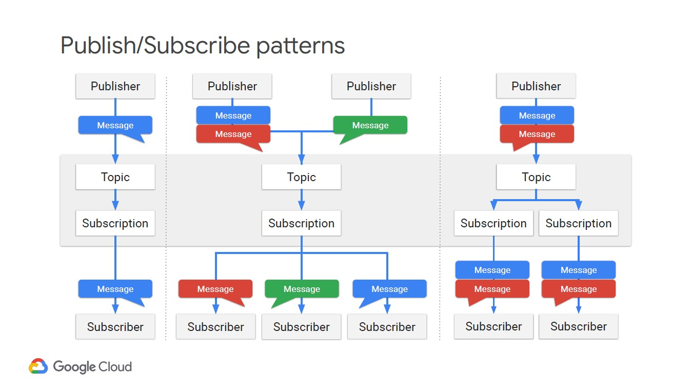

## Resources
* Data Studio: Google's open source live dashboard viz tool https://datastudio.google.com/u/0/navigation/reporting

# Building Streaming systems

## Processing Streaming Data
* Challenges of streaming data: 
    * Volume (TB, PB)
        > Solutions: Autoscaling, processing and analysis

    * Velocity (real-time)
        > Solutions: Streaming processing - 
    * Variety (unstructured)
        > Solutions: AI
    > Cloud Pub/Sub, which will allow us to handle changing and variable volumes of data, Cloud Dataflow, which can assist in processing data without undue delays, and BigQuery, which we will use for our ad-hoc reporting, even on streaming data.

## Cloud Pub/Sub
* Data distribution and messaging delivery system
* Fully managed service
* commonly used to loosely-couple parts of a system
* client libraries are available in C#, GO, Java, Node.js, Python, Ruby.
* messages encrypted in transit and rest
* **Highly available**: connected apps do not need to be online and available
all the time. And the parts do not need to know how to communicate to each other (asynchronous messages), but only to Cloud Pub/Sub, which can simplify system design
* **Durablity of messages**: messages stored for 7 days in case downstream systems down. Not for long term storage
* **Scalable**: Currently, Google indexes the web anywhere from every 2 weeks (slowest) to multiple tiles per hour for popular news sites. So, on
average, Google is indexing the web, on average, 3 times a day. Thus, what we are doing is sending the entire world wide web over Pub/Sub three times a day.

### Pub/Sub application structure
https://cloud.google.com/pubsub/docs/overview

* The Cloud Pub/Sub client that creates the Topic is the publisher.             
    * Publisher sends messages to the topic
* The Cloud Pub/Sub client that creates the Subscription is the Subscriber.
    * Subscribers recieve messages published to a topic
* Subscription is subscribed to the Topic. 
    * Can be multiple subscriptions to each topic - all independent from other clients in system
    * can be many subscribers to a subscription
* Can be multiple publishers to a topic
* Push and Pull delivery supported
    * **Pull**: subscriber initiates request for message, pulls message, sends acknowledgement to confirm message received. 
        * only have one web inpoint, so typically only one subscriber. But, that one subscriber could be a app engine standard app, or cloud run container image, which autoscales to message volume
    * **Pull**: Pub/Sub initiates HTTP request. Acknowledgement in the form of HTTP success from subscriber
* A message is resent if subscriber takes more than ackDeadline to respond
    * acknowledge on a per subscription basis. So, if you have two subscriptions, you have one acknowledge and the other one doesn’t, the one that acknowledged will continue to get the messages
* Messages stored for up to 7 days -
* Messages transmitted in bytes, so can be images and other files
* 10MB limit per message
* By default, the Publisher batches messages - increases efficiency by the publisher but increases latency. Trade off
    * Built in buffering
* Messages could be in any order/duplicated (e.g. if backlog, resent)
* Pub/Sub Lite in beta (not yet in Australia), single zone service. Reglar Pub/Sub is Global     

## Dataflow Streaming Features
* Scalable and low latency low latency processing pipeline for incoming messages
* Fault tolerance and timing becomes more important for processing unbounded/real time data

### Windowing capability in Dataflow
* Divide the stream into a series of finite windows - Dataflow supports this
    * using timestamp on message from Pub/Sub
* Types of windows
    * Fixed: consistent time-based finite chunks, non-overlapping e.g. hourly.
    * Sliding: time windows can overlap, for example, in a running average.
    * Session: windows defined by a minimum gap duration and the timing is triggered
by another element.
* Dealing with latency:
    * Lag time is the difference between expected and actual arrival time
    * Watermarks provide flexibility for some lag time when performing aggregations
        * Watermark is the latest time data is expected by. After this point, data won't be included in the aggregation
    * Dataflow  continuously compute the watermark, which is how far behind we are. 
        * Beam’s default windowing configuration tries to determines when all data has arrived(based on the type of data source) and then advances the watermark past the end of the window. https://beam.apache.org/documentation/programming-guide/#windowing-basics
    * Triggers are used to determine how to process data as it arrives
        * `Event time` triggers operate on the date-timestamp associated with each element. 
            * AfterWatermark trigger: Apache Beam determines when all the elements with a date-timestamp that falls within the window have been processed. This is the Watermark. The passing of the Watermark causes the aggregation step to be performed. 
            * After the Watermark has passed, the default event time trigger is activated and data discards data that arrives late
        * `Processing time` triggers operate on the time at which an element is processed at some point in the pipeline as determined by a system clock.
            * e.g. AfterProcessingTime trigger on unbounded data contained in a global window emits data every 30 seconds indefinitely
        * `data-driven` trigger is associated with the condition of data contained in the element itself.
            * e.g. AfterCount trigger emits data every time the PCollection reaches 15 elements
        * `Composite` triggers combine effects

* Java Apache Beam pipelines have the best functionality for streaming pipelinse (over Python)        

## BigQuery streaming features
* Streaming Inserts method allows data to be streamed directly into BQ

### Visualise BQ query results with Data Studio
* Connect directly to BQ or other GSuite services as data sources
* Various 3rd party APIs connectors e.g. Facebook, Twitter, Kaggle

## BigTable streaming features
* Fully managed, scalable NoSQL database with low latency ( query petabytes in milliseconds)
* To use Bigtable effectively you have to know a lot about your data and how it
will be queried upfront. A lot of the optimizations happen before you load data into
 Bigtable.

 ### Choosing between Bigtable an BigQuery
 * BigQuery: 
    * Optimised for SQL
    * Serverless
    * Latecy in seconds acceptable
    * Streams 100,000 rows / second
* Bigtable:

    * Optiimsed for fast store
    * High throughput - 100,000 queries per second (10 nodes at 6ms latency)
    * Compute scales linearly with more nodes in cluster
    * NoSQL:non-structured key/value data; each value is typically <10 MB.
    * Not good for highly structured data, transactional data, small data (less than 1 TB),and anything requiring SQL Queries and SQL-like joins.
    * Best for:
        * High throughput
        * data size >1TB
        * Time series
        * Natural semantic ordering
        * Real-time processing
        * Asynchronous batch
        * Rapidly changing
    * Most common use case: Productionize a real-time lookup as part of an
application, where speed and efficiency are desired beyond that of other databases.        

### Bigtable Architecture
* Storage (Collosus) > Jupiter network > Compute (Bigtable cluster)
* Data stored as tablet data structure within Collosus file system
    * metadata about the Tablets is stored on the VMs in the Bigtable cluster itself.
* Bigtable cluster "learns" how to best store tablets according to access patterns
    * It detects "hot spots" where a lot of activity is going through a single Tablet and splits the Tablet in two. 
    * It can also rebalance the processing to equally distribute read and writes equally across nodes in the Bigtable cluster. It does this by moving the reference to a Tablet to a different VM in the cluster.
* Clients connecting to Bigtable are assigned Application Profiles which stipulte the routing policy for requests (single/multi cluster) 

#### Schema design
* Bigtable stores data in tables - so tables with rows and columns. However, unlike SQL databases, Cloud Bigtable has only one index - the Row Key
* Single Row Key index - choice is important. To get the best performance,
    * choose a row key that groups related rows so they are adjacent
    * get your data in order first, if possible, and 
    * select or construct a Row Key that minimizes sorting and searching and turns your most common queries into scans.
* Choosing a row key (designing schema) is important for performance (test driven)
    * https://cloud.google.com/bigtable/docs/schema-design
    * use human readable row key values. Composite keys acceptable
    * keep row key values short for memory usage    
* Column families:
    * Whenever there are rows containing multiple column values that are related, best to group them into a column family
    * it is more efficient to retrieve data from one or more column families than retrieving all of the data in a row.   
* When deleting data, Bigtable does not immediately delete. Similarly, for a change to data, new row is appended sequentially to the end of the table, and the previous version is marked for deletion. So both rows exist for a period of time. Periodically, Cloud Bigtable compacts the table, removing rows marked for
deletion and reorganizing the data for read and write efficiency.

## Cloud Spanner DB
* Globally consistent SQL data base that scales (horizontally) across regions
    * Pexos based algo enables consistency
* Highly available due to multi-regional consistency    
* Google uses internally for storing metadata about storage sets - which is how BQ and GCS stores data in Collosus FS
* On the fly schema changes, no downtime
* Spanner physically replicates data across regions via Pexos
    * 1 Leader replica (read-write), remaining are read-only replicas. 
* Storage (Collosus) > Jupiter network > Compute 
* Competitor: Snowflake
* Use cases:
    * global ticket sales to global audience

## Advanced BigQuery functions
* Usual ANSI SQL advanced functions: https://cloud.google.com/bigquery/docs/reference/standard-sql
* Use WITH clauses and subqueries to modularize complex queries
* BigQuery Geo Viz (beta):  web tool for visualization of geospatial data in BigQuery using Google Maps APIs. https://cloud.google.com/bigquery/docs/gis-visualize
    * run a SQL query and display the results on an interactive map
    * supports geometry inputs (points, lines, and polygons) that are retrieved as a GEOGRAPHY column. You can use BigQuery's geography functions to convert latitude and longitude to GEOGRAPHY.
    * Access from Jupyter notebooks via GeoJSON extension. To use this extension, your BigQuery GIS data must be in GeoJSON format.
* For large data sets, use APPROX_xxxx functions, which make more efficient statistical estimations of params e.g. APPROX_COUNT_DISTINCT    