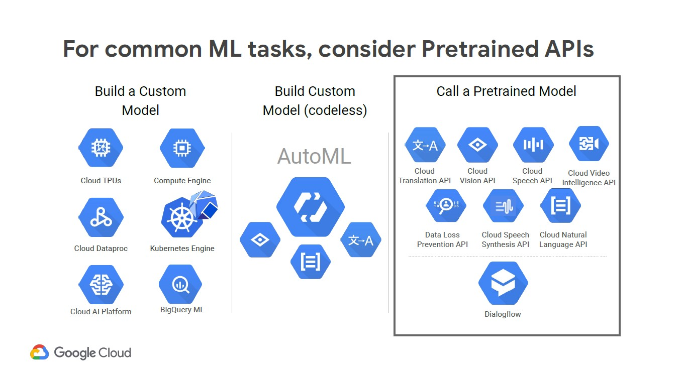
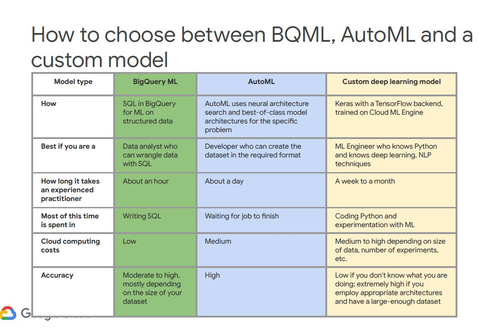
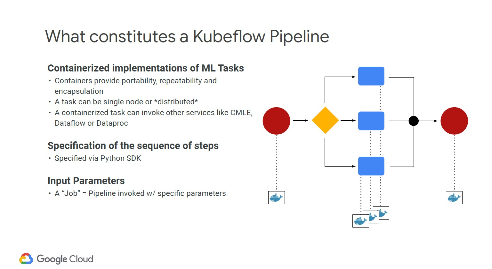
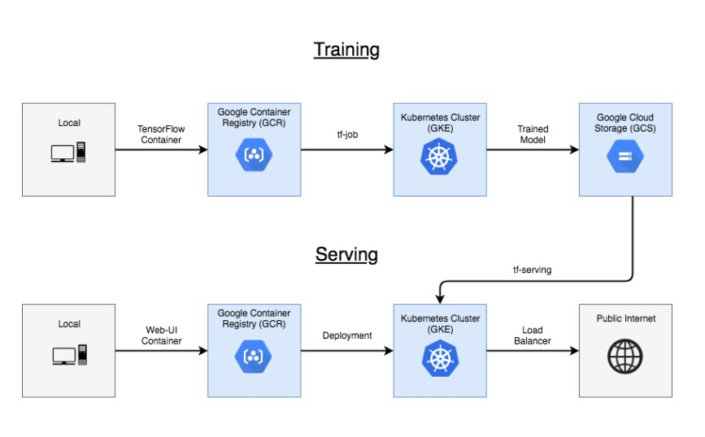

## Resources
* Set up billing export to BigQuery dataset. Set up dataset > Export from Billing
* https://experiments.withgoogle.com/
* GCP Python client library: https://github.com/googleapis/google-cloud-python#google-cloud-python-client
* Labs git repo: https://github.com/GoogleCloudPlatform/training-data-analyst/tree/master/courses

# ML & AI

## Prebuilt ML model APIs for Unstructured Data


* Use ML on GCP using either
    * AI Platform (your model, your data)
    * AutoML (our models, your data)
    * Pretrained models (our models, our data)
        * Vision, Natural Language, Translation, Dialogueflow etc
* The recommended application strategy is to 
    1. use the pre-built artificial intelligence services. 
    2. use Cloud  AutoML to produce Custom Models which can be used with the pre-built services or on their own. Remember that you can divide a problem into specialized parts and use multiple Custom Models together. 
    3. Finally, if you discover you need more advanced features, you can use the Machine Learning and Artificial Intelligence services to create new models.        
    

### NLP API classifyText 
* https://cloud.google.com/natural-language/docs/classify-text-tutorial
* returns a list of content categories (700+ available) that apply to a text document
* To use API on a corpus of data:
    1. Create a service account to authenticate to API
        ```bash
        export PROJECT=<your_project_name>

        gcloud iam service-accounts create my-account --display-name my-account
        gcloud projects add-iam-policy-binding $PROJECT --member=serviceAccount:my-account@$PROJECT.iam.gserviceaccount.com --role=roles/bigquery.admin
        gcloud iam service-accounts keys create key.json --iam-account=my-account@$PROJECT.iam.gserviceaccount.com
        export GOOGLE_APPLICATION_CREDENTIALS=key.json
        ```
    2. Create a .py file that pulls files from GCS, calls API to get categories, saves to BigQuery

## Big Data Analytics with Jupyter notebooks
* AI Platform Jupyterlab service is free, pay for compute 
    * AI Platform > Notebooks
* Jupyter magics to BigQuery from AI Platform notebooks - use before SQL query to return a pandas data frame ("mydf" in example): `%%bigquery`
    ```python
    %%bigquery mydf
    SELECT
    departure_delay,
    FROM
    `bigquery-samples.airline_ontime_data.flights`
    LIMIT 1
    ```

## Kubeflow: ML Pipelines that leverage Kubernetes clusters
* Building Pipelines are free. Compute using Kubernetes cluster is charged
* Platform with tools and scalable services required to develop and deploy ML workloads end to end:  distributed training, scalable serving, notebooks, workflow orchestration.
* built on top on Kubernetes. Kubernetes provides scalability and hybrid protability.
    * Kubernetes cluster is used to execute the ML pipeline
* Kubeflow is open source and can run on any Kubernetes cluster, and thus applications built on Kubeflow are portable across clouds and on-premise environments.

* YAML files configure the Kubeflow installation
* Create pipelines with Python SDK
* visualisation of pipelines
* parallel model training tasks
* Kubflow utilities
    * Kustomize to manage deployments. This is a way to setup an application so that the same code can be deployed across different environments. It will build the YAML files to spec
    * kfctl, the Kubeflow command-line tool
* Example Kubeflow pipeline
    

### AI Hub
* Pre-canned Kubeflow pipeline templates
* Other assets
    * Kubeflow pipelines and components
    * Jupyter notebooks
    * TensorFlow modules
    * Trained models
    * Services
    * VM images
* One-click deployment of ML pipelines via Kubeflow on GCP as platform for AI, or on premise.

## BigQuery ML: Custom Model Development with SQL 
* Data set must be in BigQuery
* Supports Train, predict, evaluate
    * TRANSFORM does (simple) feature engineering
* Linear classifiers, linear regression, xgboost, matrix factorisation, kmeans clustering

## Cloud AutoML: Train custom models without code
* AutoML follows a standard procedure that is divided into train, deploy, and serve phases
* Supports ensemble models
* Data inputs
    * "Prepared Dataset" = CSV file with source data metadata. Must be UTF-8 encoded and located in the same Cloud Storage bucket with the source files. You can also create and manage Prepared Datasets programmatically in Python, Java, or Node.js
        * Contains Train/Test/Validation assignment, source data file, label
* Flavours:
    * AutoML Vision (image classification)
    * AutoML NLP
        * If a NLP Custom Model is not used for 60 days, it will be deleted.
        * If a NLP Custom Model is being used, it will be deleted after 6 months.
            * So you must train a new model every 6 months.
    * AutoML Tables (structured data)
        * works best with BigQuery data source
* The training and serving methods inside Cloud AutoML not guaranteed to be backwardly compatible. They may render a Custom Model incompatible with the current service. So you should plan to periodically re-generate the Custom Model to keep using it.        
  